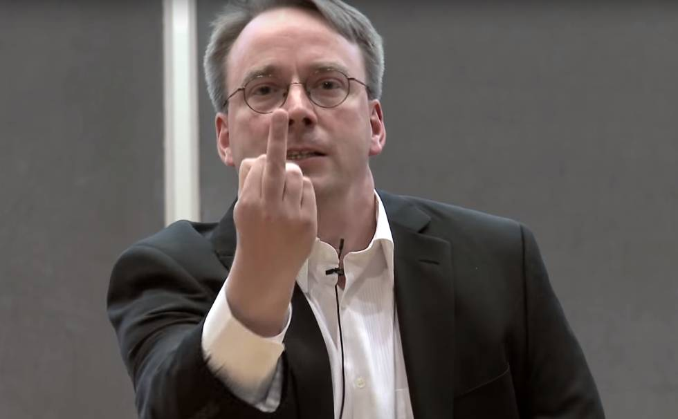

# 1. Los sistemas operativos Linux. Características. Historia.

## Historia de Linux

### Richard Stallman. GNU

En 1983 Richard Stallman tras trabajar con unix, el cual es un sistema operativo propietario de los Laboratorios Bell de AT&T, Stallman empieza a tener problemas con este sistema operativo, ya que no podía modificarlo, mejorarlo o adaptarlo a sus necesidades.

Por este motivo inició el proyecto GNU, acrónimo de GNU is NOT UNIX, con la idea de crear software libre, que cada programador pudiera modificar si así lo quisiera y que fuera compatible con unix.

Esto motivó a muchos desarrolladores a crear programas y aplicaciones independientes de software libre y en pocos años se había desarrollado prácticamente un S.O. completamente libre. Sin embargo, aún faltaba el kernel.

### Linus Torvalds. Inicios de Linux

Esta última parte la realizó Linus Torvalds, estudiante de informática en la universidad de Helsinki.

  

Entró en la universidad en 1988, año en el que se empezó a utilizar también Minix, este S.O. estaba basado en Unix pero se desarrolló con una intención didáctica. El problema es que, su creador Andy Tannenbaum, no tuvo en cuenta en ningún momento asociar Minix al proyecto GNU, decidió ceder sus derechos y empezaron a cobrar 150 dólares por licencia, lo cual era un precio alto para los estudiantes a los que iba dirigido.

Linus, que formaba parte de la comunidad de Minix, decidió crear un nuevo kernel de Unix con la filosofía de GNU. Basándose en el de Minix, fue modificando progresivamente para que fuera capaz de ejecutar aplicaciones GNU.

La primera versión de Linux 0.02  se hizo pública en 1991, el cual ya contaba con un compilador de C, pero poco más funcionaba. En posteriores versiones se unieron más programadores al proyecto a través de internet y después de de un tiempo se llegó a la versión 1.0 en 1994.

## Sistemas operativos Linux

Se conoce como  sistemas operativos Linux, aquellos que se han desarrollado a partir del kernel o núcleo de Linux y con la filosofía GNU.

Existen múltiples distribuciones de Linux. Algunas de las más conocidas pueden ser Ubuntu, Debian o Fedoraç, por poner algunos ejemplos.

## Características

* Multitarea: La palabra multitarea describe la habilidad de ejecutar varios programas al mismo tiempo. LINUX utiliza la llamada multitarea preventiva, la cual asegura que todos los programas que se están utilizando en un momento dado serán ejecutados, siendo el sistema operativo el encargado de ceder tiempo de microprocesador a cada programa.

* Multiusuario: Muchos usuarios usando la misma máquina al mismo tiempo.

* Multiplataforma: Las plataformas en las que en un principio se puede utilizar Linux son 386-, 486-. Pentium, Pentium Pro, Pentium II,Amiga y Atari, tambien existen versiones para su utilización en otras plataformas, como Alpha, ARM,MIPS, PowerPC y SPARC.

* Multiprocesador: Soporte para sistemas con más de un procesador esta disponible para Intel y SPARC.

* Protección de la memoria entre procesos, de manera que uno de ellos no pueda colgar el sistema.

* Carga de ejecutables por demanda: Linux sólo lee del disco aquellas partes de un programa que están siendo usadas actualmente.

* Política de copia en escritura para la compartición de páginas entre ejecutables: esto significa que varios procesos pueden usar la misma zona de memoria para ejecutarse. Cuando alguno intenta escribir en esa memoria, la página (4Kb de memoria) se copia a otro lugar. Esta política de copia en escritura tiene dos beneficios: aumenta la velocidad y reduce el uso de memoria.

* Memoria virtual usando paginación (sin intercambio de procesos completos) a disco: A una partición o un archivo en el sistema de archivos, o ambos, con la posibilidad de añadir más áreas de intercambio sobre la marcha Un total de 16 zonas de intercambio de 128Mb de tamaño máximo pueden ser usadas en un momento dado con un límite teórico de 2Gb para intercambio. Este límite se puede aumentar fácilmente con el cambio de unas cuantas líneas en el código fuente.

* La memoria se gestiona como un recurso unificado para los programas de usuario y para el caché de disco, de tal forma que toda la memoria libre puede ser usada para caché y ésta puede a su vez ser reducida cuando se ejecuten grandes programas.


* Todo el código fuente está disponible, incluyendo el núcleo completo y todos los drivers, las herramientas de desarrollo y todos los programas de usuario; además todo ello se puede distribuir libremente. Hay algunos programas comerciales que están siendo ofrecidos para Linux actualmente sin código fuente, pero todo lo que ha sido gratuito sigue siendo gratuito.

* Control de tareas POSIX.

* Pseudo-terminales (pty's).

* Emulación de 387 en el núcleo, de tal forma que los programas no tengan que hacer su propia emulación matemática. Cualquier máquina que ejecute Linux parecerá dotada de coprocesador matemático. Por supuesto, si el ordenador ya tiene una FPU (unidad de coma flotante), esta será usada en lugar de la emulación, pudiendo incluso compilar tu propio kernel sin la emulación matemática y conseguir un pequeño ahorro de memoria.

* Soporte para muchos teclados nacionales o adaptados y es bastante fácil añadir nuevos dinámicamente.

* Consolas virtuales múltiples: varias sesiones de login a través de la consola entre las que se puede cambiar con las combinaciones adecuadas de teclas (totalmente independiente del hardware de video). Se crean dinámicamente y puedes tener hasta 64.

* Soporte para varios sistemas de archivo comunes, incluyendo minix-1, Xenix y todos los sistemas de archivo típicos de System V, y tiene un avanzado sistema de archivos propio con una capacidad de hasta 4 Tb y nombres de archivos de hasta 255 caracteres de longitud.

* Acceso transparente a particiones MS-DOS (o a particiones OS/2 FAT) mediante un sistema de archivos especial: no es necesario ningún comando especial para usar la partición MS-DOS, esta parece un sistema de archivos normal de Unix (excepto por algunas restricciones en los nombres de archivo, permisos, y esas cosas). Las particiones comprimidas de MS-DOS 6 no son accesibles en este momento, y no se espera que lo sean en el futuro. El soporte para VFAT (WNT, Windows 95) ha sido añadido al núcleo de desarrollo y estará en la próxima versión estable.
