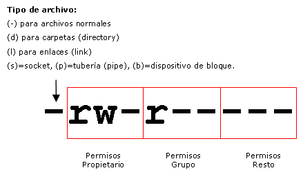
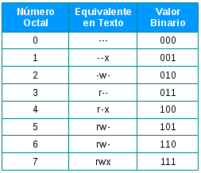
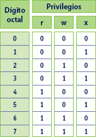

# 10.Permisos

## ¿Cómo funcionan los permisos en Linux?
En Linux todos los ficheros y directorios pertenecen a un usuario y al grupo primario del mismo (es decir, cuando se crea un fichero o directorio este pertenece al usuario creador y a su grupo principal).
Cuando visualizamos la información de permisos sobre un fichero (con comando de listado como ‘ls -l’, los cuales se explican en el apartado 4) se nos mostrará como se puede observar en el siguiente ejemplo:
  
  
  
Como se analiza en la imagen la primera parte hace referencia al tipo de archivo, existiendo entre otros lo siguientes:
  
  
  
Como se puede observar en la primera imagen los permisos de dividen en 3 (lectura, escritura y ejecución), siendo estos indicados en orden para el usuario propietario, el grupo y otros. Estos permisos se pueden otorgar en 3 formatos (en binario, en octal o de manera simbólica indicando con las letras de cada permiso: ‘r’, ‘w’, ‘x’ o ‘-’ en caso de no querer otorgar el permiso), como se puede observar en la siguientes tablas de equivalencias:    

Entre octal y binario la equivalencia y la lectura será de la siguiente manera:  

## Gestión de permisos 
Aunque la gestión de permisos en Linux se puede realizar de forma gráfica nos vamos a centrar en la gestión mediante el uso de comandos en la terminal, entre estos cabe destacar los siguientes comandos:

	chmod (change mode)

Este comando nos permitirá realizar cambios de permisos de protección sobre un fichero o directorio. Para usarlo debemos indicar las iniciales del usuario o grupo al que va dirigidos (siendo ‘u’ para el usuario propietario, ‘g’ para el grupo primario del usuario, ‘o’ para el resto de usuarios y ‘a’ para todos los usuarios), con ‘+’ o ‘-’ indicaremos si deseamos añadir o quitar los permisos que le indicamos y con ‘=’ asignaremos solo los permisos indicados (eliminando el resto de permisos del usuario o grupo, si los tuviera).

Ejemplos (también se podrían realizar con el formato binario y octal como indicamos en el apartado anterior): ‘chmod u+rw atracos’, ‘chmod ug+r’, ‘chmod ug=r’.

	chown (change owner)

Con este comando podemos cambiar el usuario propietario de un fichero. Para usarlo tendremos que indicar el usuario que va a ser propietario y el objeto al que se le ve a establecer la propiedad.

Ejemplo: ‘chown pepe /home/atraco’.

	chgrp (change group)

Este comando nos permite modificar el grupo propietario de un fichero.
Para usarlo tendremos que indicar dos parámetros, el grupo que va a ser propietario y el objeto al que se le va a establecer la propiedad.

Ejemplo: ‘chgrp delincuentes pruebas’ (al fichero ‘pruebas’ le hemos asignado como nuevo grupo propietario al grupo ‘delincuentes’).

	umask (user mask)

Cuando se crea un nuevo fichero a este se le es asignado una serie de permisos de manera automática (debido a la máscara de permisos, la cual se los asigna con el valor octal a la hora de aplicarlos).
Este comando nos permitirá conocer el valor por defecto de dicha máscara y en caso de querer modificarlo solo tendremos que insertar un valor en octal después de la instrucción (ejemplo: ‘umask 057’).
