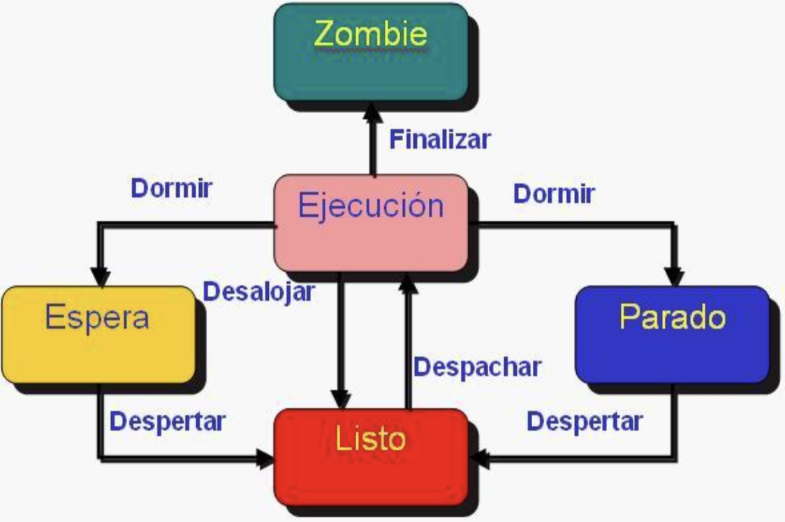

# 15. Procesos, tipos, estados & estructura.
Podríamos definir a los procesos como programas que están corriendo en nuestro Sistema Operativo. Se pueden clasificar en tres grandes categorías:
Procesos Normales: son lanzados en una terminal (tty) Y corren a nombre de un usuario.
Procesos Daemon: corren a nombre de un usuario y no tienen salida directa por una terminal, es decir corren en 2º plano.
Procesos Zombie: completa su ejecución pero aún tiene una entrada en la tabla de procesos.

Los principales estados en los que pueden encontrarse los procesos en Linux/Unix son los siguientes:

running (R) : Procesos que están en ejecución.
sleeping (S) : Procesos que están esperando su turno para ejecutarse.
stopped (D) : Procesos que esperan a que se finalice alguna operación de Entrada/Salida.
zombie (Z) : Procesos que han terminado pero que siguen apareciendo en la tabla de procesos.

ESTRUCTURA:

