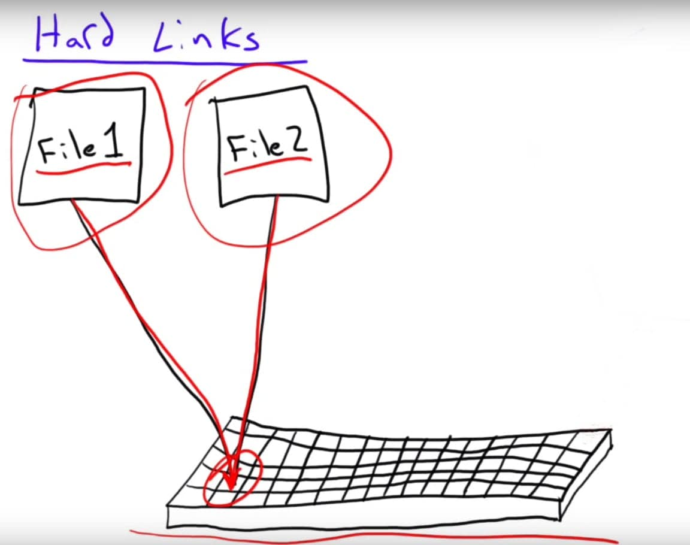
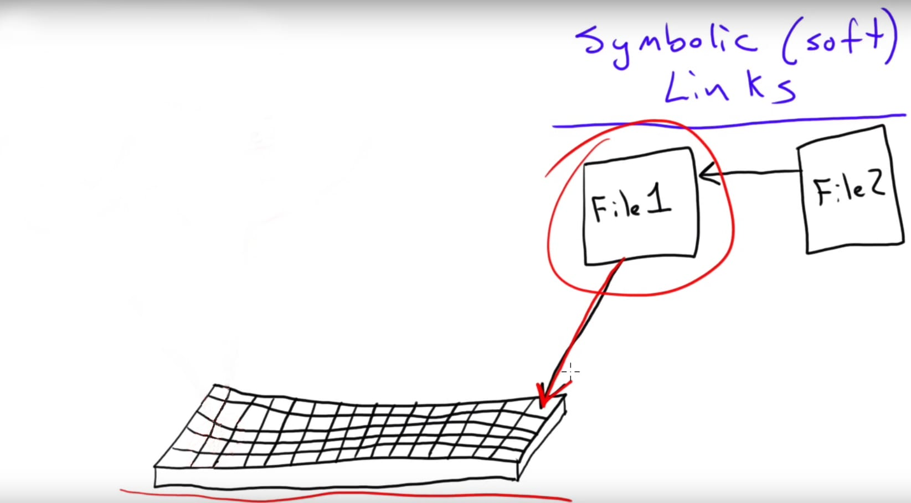
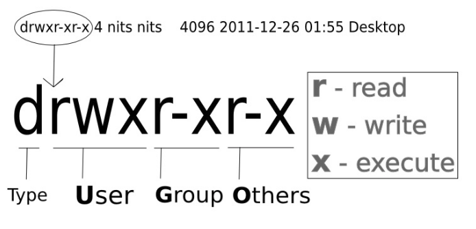
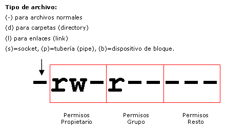
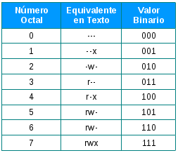
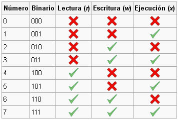
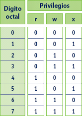
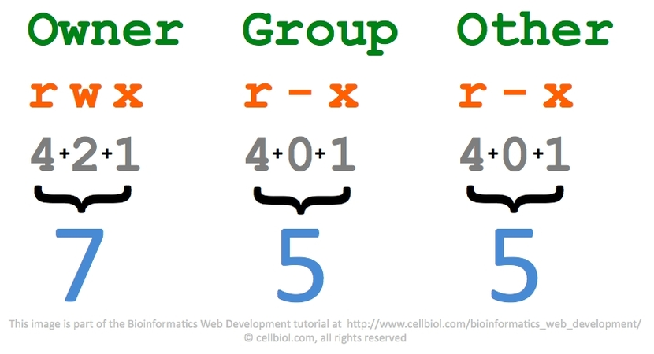

# Administración de la información y  de software de base en sistemas Linux.

## 1. Los sistemas operativos Linux. Características. Historia.

### Historia de Linux

#### Richard Stallman. GNU

En 1983 Richard Stallman tras trabajar con unix, el cual es un sistema operativo propietario de los Laboratorios Bell de AT&T, Stallman empieza a tener problemas con este sistema operativo, ya que no podía modificarlo, mejorarlo o adaptarlo a sus necesidades.

Por este motivo inició el proyecto GNU, acrónimo de GNU is NOT UNIX, con la idea de crear software libre, que cada programador pudiera modificar si así lo quisiera y que fuera compatible con unix.

Esto motivó a muchos desarrolladores a crear programas y aplicaciones independientes de software libre y en pocos años se había desarrollado prácticamente un S.O. completamente libre. Sin embargo, aún faltaba el kernel.

#### Linus Torvalds. Inicios de Linux

Esta última parte la realizó Linus Torvalds, estudiante de informática en la universidad de Helsinki.

Entró en la universidad en 1988, año en el que se empezó a utilizar también Minix, este S.O. estaba basado en Unix pero se desarrolló con una intención didáctica. El problema es que, su creador Andy Tannenbaum, no tuvo en cuenta en ningún momento asociar Minix al proyecto GNU, decidió ceder sus derechos y empezaron a cobrar 150 dólares por licencia, lo cual era un precio alto para los estudiantes a los que iba dirigido.

Linus, que formaba parte de la comunidad de Minix, decidió crear un nuevo kernel de Unix con la filosofía de GNU. Basándose en el de Minix, fue modificando progresivamente para que fuera capaz de ejecutar aplicaciones GNU.

La primera versión de Linux 0.02  se hizo pública en 1991, el cual ya contaba con un compilador de C, pero poco más funcionaba. En posteriores versiones se unieron más programadores al proyecto a través de internet y después de de un tiempo se llegó a la versión 1.0 en 1994.

### Sistemas operativos Linux

Se conoce como  sistemas operativos Linux, aquellos que se han desarrollado a partir del kernel o núcleo de Linux y con la filosofía GNU.

Existen múltiples distribuciones de Linux. Algunas de las más conocidas pueden ser Ubuntu, Debian o Fedoraç, por poner algunos ejemplos.

### Características

* Multitarea: La palabra multitarea describe la habilidad de ejecutar varios programas al mismo tiempo. LINUX utiliza la llamada multitarea preventiva, la cual asegura que todos los programas que se están utilizando en un momento dado serán ejecutados, siendo el sistema operativo el encargado de ceder tiempo de microprocesador a cada programa.

* Multiusuario: Muchos usuarios usando la misma máquina al mismo tiempo.

* Multiplataforma: Las plataformas en las que en un principio se puede utilizar Linux son 386-, 486-. Pentium, Pentium Pro, Pentium II,Amiga y Atari, tambien existen versiones para su utilización en otras plataformas, como Alpha, ARM,MIPS, PowerPC y SPARC.

* Multiprocesador: Soporte para sistemas con más de un procesador esta disponible para Intel y SPARC.

* Protección de la memoria entre procesos, de manera que uno de ellos no pueda colgar el sistema.

* Carga de ejecutables por demanda: Linux sólo lee del disco aquellas partes de un programa que están siendo usadas actualmente.

* Política de copia en escritura para la compartición de páginas entre ejecutables: esto significa que varios procesos pueden usar la misma zona de memoria para ejecutarse. Cuando alguno intenta escribir en esa memoria, la página (4Kb de memoria) se copia a otro lugar. Esta política de copia en escritura tiene dos beneficios: aumenta la velocidad y reduce el uso de memoria.

* Memoria virtual usando paginación (sin intercambio de procesos completos) a disco: A una partición o un archivo en el sistema de archivos, o ambos, con la posibilidad de añadir más áreas de intercambio sobre la marcha Un total de 16 zonas de intercambio de 128Mb de tamaño máximo pueden ser usadas en un momento dado con un límite teórico de 2Gb para intercambio. Este límite se puede aumentar fácilmente con el cambio de unas cuantas líneas en el código fuente.

* La memoria se gestiona como un recurso unificado para los programas de usuario y para el caché de disco, de tal forma que toda la memoria libre puede ser usada para caché y ésta puede a su vez ser reducida cuando se ejecuten grandes programas.


* Todo el código fuente está disponible, incluyendo el núcleo completo y todos los drivers, las herramientas de desarrollo y todos los programas de usuario; además todo ello se puede distribuir libremente. Hay algunos programas comerciales que están siendo ofrecidos para Linux actualmente sin código fuente, pero todo lo que ha sido gratuito sigue siendo gratuito.

* Control de tareas POSIX.

* Pseudo-terminales (pty's).

* Emulación de 387 en el núcleo, de tal forma que los programas no tengan que hacer su propia emulación matemática. Cualquier máquina que ejecute Linux parecerá dotada de coprocesador matemático. Por supuesto, si el ordenador ya tiene una FPU (unidad de coma flotante), esta será usada en lugar de la emulación, pudiendo incluso compilar tu propio kernel sin la emulación matemática y conseguir un pequeño ahorro de memoria.

* Soporte para muchos teclados nacionales o adaptados y es bastante fácil añadir nuevos dinámicamente.

* Consolas virtuales múltiples: varias sesiones de login a través de la consola entre las que se puede cambiar con las combinaciones adecuadas de teclas (totalmente independiente del hardware de video). Se crean dinámicamente y puedes tener hasta 64.

* Soporte para varios sistemas de archivo comunes, incluyendo minix-1, Xenix y todos los sistemas de archivo típicos de System V, y tiene un avanzado sistema de archivos propio con una capacidad de hasta 4 Tb y nombres de archivos de hasta 255 caracteres de longitud.

* Acceso transparente a particiones MS-DOS (o a particiones OS/2 FAT) mediante un sistema de archivos especial: no es necesario ningún comando especial para usar la partición MS-DOS, esta parece un sistema de archivos normal de Unix (excepto por algunas restricciones en los nombres de archivo, permisos, y esas cosas). Las particiones comprimidas de MS-DOS 6 no son accesibles en este momento, y no se espera que lo sean en el futuro. El soporte para VFAT (WNT, Windows 95) ha sido añadido al núcleo de desarrollo y estará en la próxima versión estable.


## 2. Sistemas de archivos de Linux.

Los sistemas de archivos son métodos que utiliza un sistema operativo para localizar los archivos de un disco o partición. Es decir, es la manera en la que se organizan los archivos del disco.

La diferencia entre un disco y el sistema de archivos que contiene es importante, ya que hay pocos programas que trabajan directamente sobre los sectores crudos del disco, salvo los que crean sistemas de archivos o particiones. La mayoría de los programas trabajan  sobre un sistema de archivos concreto.

La mayoría de los sistema de archivos UNIX tienen una estructura general parecida, aunque los detalles exactos pueden variar un poco. Los conceptos centrales son superbloque, nodo-i, bloque de datos, bloque de directorio, y bloque de indirección. El superbloque tiene información del sistema de archivos en conjunto, como su tamaño (la información precisa aquí depende del sistema de archivos). Un nodo-i tiene toda la información de un archivo, salvo su nombre. El nombre se almacena en el directorio, junto con el número de nodo-i. Una entrada de directorio consiste en un nombre de archivo y el número de nodo-i que representa al archivo. El nodo-i contiene los números de varios bloques de datos, que se utilizan para almacenar los datos en el archivo. Sólo hay espacio para unos pocos números de bloques de datos en el nodo-i; en cualquier caso, si se necesitan más, más espacio para punteros a los bloques de datos son colocados de forma dinámica. Estos bloques colocados dinámicamente son bloques indirectos; el nombre indica que para encontrar el bloque de datos, primero hay que encontrar su número en un bloque indirecto.

Los sistemas de archivos más utilizados en linux son ext2, ext3, ext4 ReiserFS, XFS, JFS, UFS, ISO9660 y también cuenta con compatibilidad de sistemas de archivos de Windows como FAT, FAT32 o NTFS.


## 3. Rutas y nombres de archivos. Estructura jerárquica.

### Estructura jerárquica.

El estándar de jerarquía del sistema de archivos (o FHS, del inglés Filesystem Hierarchy Standard) es una norma que define los directorios principales y sus contenidos en el sistema operativo GNU/Linux y otros sistemas de la familia Unix. Se diseñó originalmente en 1994 para estandarizar el sistema de archivos de las distribuciones de Linux, basándose en la tradicional organización de directorios de los sistemas Unix. En 1995 se amplió el ámbito del estándar a cualquier Unix que se adhiriese voluntariamente.

FHS no es más que un documento guía, es decir, cualquier fabricante de software independiente o cualquier persona que decida crear una nueva distribución GNU/Linux, podrá aplicarlo o no a la estructura del sistema de archivos, con la ventaja de que si lo integra en el sistema, el entorno de éste será mucho más compatible con la mayoría de las distribuciones.

Es importante saber que el estándar FHS es en cierto modo flexible, es decir, existe cierta libertad en el momento de aplicar las normas. De ahí que existan en la actualidad leves diferencias entre distribuciones GNU/Linux.

### Rutas y nombres de archivos.

Linux organiza ficheros y carpetas en un estructura de árbol. Un fichero está siempre en una carpeta, y una carpeta puede contener ficheros y subcarpetas. La carpeta de más alto nivel en esta jerarquía en Linux siempre tiene el nombre “/”.

Todo fichero o carpeta tiene una ruta absoluta que es la secuencia de carpetas que se atraviesan desde la raíz separadas por el símbolo “/” y que termina con su propio nombre. Por ejemplo, /dirA/dirB/dirC/fichero.txt es la ruta absoluta del fichero fichero.txt almacenado en la carpeta dirC que a su vez está contenida en la carpeta dirB, a su vez contenida en la carpeta dirA almacenada en la raíz del sistema de ficheros.

	/dirA/dirB/dirC/fichero.txt

“..”: Es la carpeta del nivel superior en la jerarquía de ficheros que contiene a esta. Esta subcarpeta también esta presente en la raíz del sistema de ficheros (la carpeta con ruta absoluta “/”), pero apunta a si misma.

“.”: Es la propia carpeta que aparece como si fuese también una subcarpeta. Se puede considerar como una “autoreferencia” o apuntador a si misma.

Estas carpetas son a todos los efectos carpetas normales en el sistema; es decir, se pueden utilizar en las rutas. Por ejemplo, la ruta /dirA/dirB/dirC/../fichero2.txt se refiere al fichero que está almacenado en la carpeta dirB, pues desde dirC, la carpeta .. apunta a su predecesor, dirB. 

Como consecuencia de la existencia de las carpetas “.” y “..”, un fichero puede tener múltiples rutas absolutas equivalentes. Por ejemplo, las siguientes rutas se refieren todas al mismo fichero.txt:
	
	/dirA/dirB/dirC/../dirC/fichero.txt
	/dirA/dirB/dirC/./././fichero.txt
	/dirA/dirB/dirC/../../../dirA/dirB/dirC/./fichero.txt

La rutas absolutas identifican de manera única cualquier fichero o carpeta en el sistema, pero pueden llegar a ser muy largas y por tanto costosas para escribir en un comando en el intérprete. La alternativa es utilizar rutas relativas.

Una “ruta relativa” es una secuencia de nombres de carpetas separadas por “/” que no comienza por el símbolo “/” (si lo hiciera sería una ruta absoluta) y que se interpretan considerando como prefijo el directorio actual. Asumiendo que el directorio actual del intérprete es dirC la siguiente figura muestra la interpretación de diferentes rutas relativas. Nótese que ninguna de ellas comienza por el “/”:

	./fichero.txt
	../dirC/fichero.txt
	./../../../dirA/dirB/dirC/fichero.txt

## 4. Gestión de sistemas de archivos mediante comandos.

Los archivos en Linux pueden ser gestionados de forma gráfica, pero nos centraremos en la forma mas tradicional mediante el uso de comandos en la terminal. 

Entre todos los comandos que existen cabe destacar los siguientes:

	pwd (print working directory)

Nos indica cuál es el directorio en el que estamos trabajando.

	ls (list)

Listado de los archivos y directorios contenidos en el directorio actual.

	ls /etc

Pasándole la ruta de un directorio, se listará el contenido del mismo.

	ls -a

Muestra todos los archivos del directorio actual (incluido los ocultos).

	ls -l

Se muestran los archivos del directorio actual en formato largo (con permisos propietario, tamaño, fecha de modificación, etc).

	ls -lh

Añadiendo el parámetro ‘h’ se muestra el tamaño de archivos y directorios.

	ls -R

Se muestra el contenido de todos los subdirectorios.

	ls -i ‘fichero’

Muestra el número de inodo del fichero dentro del sistema de archivos.

Cabe destacar que los diferentes parámetros se pueden combinar de múltiples maneras y en cualquier orden. Por ejemplo:    ‘ls -laR’   o   ‘ls -l -a -R’, siendo igual de válidas las 2 formas.

	cd (change directory)

Esta orden permite cambiar de un directorio a otro dentro de la estructura de directorios que poseamos.

En caso de querer situarnos directamente en el directorio HOME del usuario usaremos:    ‘cd’   o   ‘cs~’.

	mkdir (make subdirectory)

Esta orden crea un nuevo directorio.

	rmdir (remove directory)

Permite eliminar un directorio vacío.

Usando el comando ‘rm-rf’ se puede eliminar un directorio y sus subdirectorios (aunque estos tengan contenido). El parámetro ‘-r’ elimina los subdirectorios (elimina de manera recursiva) y con ‘f’ realizamos todas las confirmaciones de eliminación.

	tree

Muestra de forma gráfica la estructura de un directorio (requiere instalación previa).

	cat ‘léeme’ (concatenate)

Muestra el contenido del fichero indicado como parámetro (’mifichero’).

	touch ‘mifichero’

Crea un fichero vacío con el nombre que le pasamos como parámetro (’mifichero’).

	cp (copy)

Este comando dispone de 2 funcionalidades:

   * Copiar uno o varios ficheros de un directorio a otro (ejemplo: ‘cp ./doc1 /home/usuario/’).

   * Copiar el fichero origen con un nuevo nombre si le indicamos ese nombre en el destino (ejemplo: ‘cp doc1 doc2’).

Con el parámetro ‘-v’ se muestra por pantalla los archivos que se están copiando en tiempo real.

	rm (remove)

Permite eliminar un fichero o un directorio.

Utilizando el parámetro ‘-r’  se eliminan también los subdirectorios (elimina de manera recursiva) y con el parámetro ‘f’ realizamos todas las confirmaciones de eliminación (de modo que sería: ‘rm -rf’).

	mv (move)

Permite mover un fichero de un directorio a otro (ejemplo: ‘mv dir1/doc1 /home’).

También renombra el archivo si lo dejamos en el mismo directorio o si al indicarle el destino utilizamos un nombre distinto (ejemplo: ‘mv doc1 doc2’).

	dirname

Muestra la ruta de directorios de una indicada por parámetro, eliminando el nombre del archivo (ejemplo: ‘dirname /home/usuario/.bashrc’). 

	basename

Muestra el nombre del archivo de una ruta indicada como parámetro (ejemplo: ‘basename /home/usuario/.bashrc’). 

	find

Este comando permite buscar un fichero dentro del árbol de directorios del sistema (aunque presenta un uso más amplio).

Con el parámetro ‘-name’ indicamos el nombre del fichero a buscar y con ‘-size’ los buscamos por el tamaño que le indicamos (ejemplos: ‘find /etc -size 50b’, ‘find /etc -name modprobe.conf’).

	which

Permite localizar la ruta del fichero ejecutable o comando que se le pasa como parámetro (se ejecutaría en el entorno actual).

	whereis

Este comando localiza todas las rutas donde se pueda encontrar el fichero ejecutable o comando que se le pasa como parámetro. 

## 5. Gestión de enlaces o accesos directos.

En Linux se pueden crear dos tipos de enlaces o accesos directos, los enlaces duros (también conocidos como enlaces físicos o enlaces fuertes) y los enlaces blandos (también conocidos como simbólicos o débiles).

### Enlaces duros

#### ¿Qué son?

El término hace referencia a aquellos archivos que apuntan al mismo contenido en la unidad de almacenamiento que un archivo de origen, disponiendo ambos del mismo inodo (número identificativo que tiene asignado cada fichero y carpeta). 
En resumen, se trata de un archivo (archivo original, con un inodo único) que se identifica con varios nombres. De esta forma cualquier cambio que se realice utilizando cualquiera de los nombres quedará reflejado en el archivo.
En la siguiente imagen se puede apreciar lo anteriormente explicado:
  
  
  
#### ¿Cómo se crean? 

Este tipo de enlaces se crean con el siguiente comando:

	ln ‘nombrefichero’ ‘nombreenlaceduro’ 

Ejemplo: ‘ln doc1 doc2’, de esta forma estamos creando un enlace duro llamado ‘doc2’ del archivo llamado ‘doc1’. 

Se puede comprobar que dos archivos son enlaces físicos examinando su inodo mediante el comando:

	ls -i

### Enlaces blandos

#### ¿Qué son?

Los enlaces simbólicos son lo más similar a los accesos directos en Windows, ya que a diferencia de los enlaces duros estos apuntan al nombre de un archivo y este archivo apunta al contenido almacenado en la unidad de almacenamiento, como es apreciable en la siguiente imagen explicativa:  
  
  
    
####   ¿Cómo se crean? 

Este tipo de enlaces se crean con el mismo comando que el visto anteriormente pero añadiendo el parámetro ‘-s’. En este caso se pueden especificar directorios diferentes (atención al uso de rutas relativas en el destino).

Ejemplos: ‘ln -s doc1 doc2’, ‘ln -s /home/usuario/examples /home/usuario/Escritorio/ejemplos’, ‘ln -s /home/usuario/examples ../ejemplos’.

## 6. Estructura de directorios del sistema operativo

Existen varios tipos de directorios en Linux

### Directorios compatibles

Son aquellos que se pueden acceder desde distintos equipos

	Ej.: /var/mail, /opt, /home, /var/www/html, /usr

### Directorios no compatibles

Son aquellos directorios que no se pueden compartir y su acceso y modificación están limitados al administrador del sistema

	Ej.: /etc, /boot, /var/run

### Directorios variables

Son aquellos directorios que pueden ser modificados y pueden variar su contenido sin la intervención del administrador del sistema

	Ej.: /var/log/messages, /var/mail, /var/spool/news, /home, /var/run

### Directorios estáticos

Son aquellos directorios que contienen archivos que solo pueden ser modificados con la intervención del sistema

	Ej.: /etc/password, /etc/shadow, /usr, /opt, /etc, /boot, /bin, /sbin

Los directorios mas destacables son:

### Directorio raíz (/)

Es el directorio principal, desde aquí se ramifican todos los directorios

### Directorio /bin

Se almacenan los datos ejecutables necesarios para el funcionamiento del sistema

### Directorio /boot

En el se encuentran todos los archivos necesarios para que el ordenador arranque, salvo los archivos de configuración

### Directorio /dev

Aquí se almacenan los datos acerca de nuestro hardware

### Directorio /etc

Contiene los archivos de configuración del sistema operativo

### Directorio /home

Aquí se encuentran alojados todos los archivos personales de cada usuario

### Directorio /lib

Contiene bibliotecas compartidas para ejecutar binarios de los directorios /bin y /sbin

### Directorio /mnt

Aquí se encuentran los puntos de montaje de distintos dispositivos de almacenamiento (generalmente discos duros y particiones)

### Directorio /media

Aquí se encuentran los puntos de montaje de distintos dispositivos de almacenamiento (generalmente memorias USB, lectores CD-ROM o similares)	

### Directorio /opt

Aquí se almacenan los programas que no vienen por defecto con el sistema operativo

### Directorio /proc

Se almacena información de procesos y aplicaciones en ejecución

### Directorio /root

Es el directorio /home del administrador del sistema

### Directorio /sbin

Es la variante root del directorio /bin

### Directorio /srv

Se almacenan datos que usan x servidores que se encuentren instalados en el equipo

### Directorio /tmp

Se almacenan archivos temporales de programas que posteriormente son eliminados por el sistema operativo

### Directorio /usr

Contiene la gran mayoría de programas instalados en el sistema

### Directorio /var

Contiene datos variables y temporales de los registros del sistema (Logs)

### Directorio /sys

Contiene información similar al directorio /proc, aquí encontramos información sobre el kernel del sistema

### Directorio /lost+found

Aquí se encuentran archivos y ficheros necesarios para recuperar datos en caso de una posible caída del sistema operativo

## 7. Búsqueda de información del sistema mediante comandos.

### Información del sistema (software)

Para mostrar Información del sistema podemos usar el siguiente comando:

	uname

Para listar los usuarios que han iniciado sesión en el sistema en tiempo real usamos el siguiente comando:

	who

Para mostrar información relacionada con la configuración de red usamos el siguiente comando:
	
	ifconfig
	
### Información del sistema (hardware)

Para mostrar un listado con los componentes físicos usamos el siguiente comando:

	sudo lshw	

## 8.Identificación del software instalado

Si queremos saber los programas que tenemos instalados en nuestro Ubuntu tan solo tenemos que abrir una Terminal y escribir el siguiente comando:

		dpkg –get-selections

Dependiendo la version, te aparecera una lista con todos los programas o solo los ultimos instalados.

Ademas del uso del comando anterior, se pueden ver entrando en el icono de software de Ubuntu y podemos añadir filtros. En esa misma pantalla hay un boton ‘Instaladas’ que, si pulsamos, nos mostrara las aplicaciones instaladas en el pc.

## 9.Montaje y desmontaje del dispositivo del sistema operativo

Para montar y desmontar un dispositivo de Linux, se puede hacer de 2 formas distintas, grafica y manualmente.

Para montar y demontar un disco graficamente, solo necesitamos entrar en ‘Discos’ y seleccionamos el disco que queramos montar/desmontar. Si queremos intalarlo, le daremos al triangulo que aparece en el lado derecho y, si lo que queremos es desmontarlo, le daremos al cuadrado.

Para montar/desmontar manualmente, abriremos el terminal y seguiremos la guia del siguiente video:

#### Haz click en la imagen ༼ つ ◕_◕ ༽つ

## 10. Permisos

### ¿Cómo funcionan los permisos en Linux?
En Linux todos los ficheros y directorios pertenecen a un usuario y al grupo primario del mismo (es decir, cuando se crea un fichero o directorio este pertenece al usuario creador y a su grupo principal).
Cuando visualizamos la información de permisos sobre un fichero (con comando de listado como ‘ls -l’, los cuales se explican en el apartado 4) se nos mostrará como se puede observar en el siguiente ejemplo:
  
  
  
Como se analiza en la imagen la primera parte hace referencia al tipo de archivo, existiendo entre otros lo siguientes:
  
  
  
Como se puede observar en la primera imagen los permisos de dividen en 3 (lectura, escritura y ejecución), siendo estos indicados en orden para el usuario propietario, el grupo y otros. Estos permisos se pueden otorgar en 3 formatos (en binario, en octal o de manera simbólica indicando con las letras de cada permiso: ‘r’, ‘w’, ‘x’ o ‘-’ en caso de no querer otorgar el permiso), como se puede observar en la siguientes tablas de equivalencias:    

Entre octal y binario la equivalencia y la lectura será de la siguiente manera:  

### Gestión de permisos 
Aunque la gestión de permisos en Linux se puede realizar de forma gráfica nos vamos a centrar en la gestión mediante el uso de comandos en la terminal, entre estos cabe destacar los siguientes comandos:

	chmod (change mode)

Este comando nos permitirá realizar cambios de permisos de protección sobre un fichero o directorio. Para usarlo debemos indicar las iniciales del usuario o grupo al que va dirigidos (siendo ‘u’ para el usuario propietario, ‘g’ para el grupo primario del usuario, ‘o’ para el resto de usuarios y ‘a’ para todos los usuarios), con ‘+’ o ‘-’ indicaremos si deseamos añadir o quitar los permisos que le indicamos y con ‘=’ asignaremos solo los permisos indicados (eliminando el resto de permisos del usuario o grupo, si los tuviera).

Ejemplos (también se podrían realizar con el formato binario y octal como indicamos en el apartado anterior): ‘chmod u+rw atracos’, ‘chmod ug+r’, ‘chmod ug=r’.

	chown (change owner)

Con este comando podemos cambiar el usuario propietario de un fichero. Para usarlo tendremos que indicar el usuario que va a ser propietario y el objeto al que se le ve a establecer la propiedad.

Ejemplo: ‘chown pepe /home/atraco’.

	chgrp (change group)

Este comando nos permite modificar el grupo propietario de un fichero.
Para usarlo tendremos que indicar dos parámetros, el grupo que va a ser propietario y el objeto al que se le va a establecer la propiedad.

Ejemplo: ‘chgrp delincuentes pruebas’ (al fichero ‘pruebas’ le hemos asignado como nuevo grupo propietario al grupo ‘delincuentes’).

	umask (user mask)

Cuando se crea un nuevo fichero a este se le es asignado una serie de permisos de manera automática (debido a la máscara de permisos, la cual se los asigna con el valor octal a la hora de aplicarlos).
Este comando nos permitirá conocer el valor por defecto de dicha máscara y en caso de querer modificarlo solo tendremos que insertar un valor en octal después de la instrucción (ejemplo: ‘umask 057’).

## 11. Ficheros de logs y de configuración del sistema

El sistema de logs se inicia con el siguiente script ubicado en:
	
	/etc/init.d/sysklogd

Este script engloba logs del sistema (syslogd) y logs del kernel (klogd)

Estos logs se guardan en archivos ubicados en el directorio:

	/var/log

Una gran parte de programas gestiona sus propios logs, estos se almacenan en:

	/var/log/<programa>

Los logs se van comprimiendo para evitar que se vuelvan excesivamente largos

Para monitorizar los logs por consola, usamos el siguiente comando

	tail

Estos también se pueden visualizar mediante un entorno gráfico, para ello existen diferentes programas que, según la distribución de linux que uses, puede que venga preinstalada en tu equipo.

Algunos ejemplos son KSystemLog (Es el monitor de logs del entorno de escritorio KDE), GNOME-System-Log (monitor de logs del entorno de escritorio GNOME), XLogmaster (monitor de logs de GNU) y Xwatch (monitor de logs para las librerías X)

## 12.Administracion de usuarios y grupos

Para crear usuarios en Linux necesitaremos el comando useradd, escribiendo en el terminal:

	sudo useradd juan

Si queremos que haya un comentario podemos añadir:

	sudo useradd -d /usr/juan -s /bin/csh -u 800 -c "Juan Perez Hernandez" juan

Para modificar el usuario, deberemos usar usermod de la siguiente forma:

	sudo usermod -l sego sergio

Si lo que queremos es eliminar el usuario, escribiremos en el terminal:

	sudo userdel sergio

Para crear un grupo utilizaremos el comando groupadd de la siguiente forma:

	sudo groupadd nombreDeGrupo

Para modificar el grupo:

	sudo groupmod -g 2000 profesores

Y para eliminar:

	sudo  groupdel profesores

Para añadir o eliminar usuarios del grupo, se utilizaran los comandos:

	sudo adduser juan profesores
	sudo deluser juan profesores

## 13. Compresión/Descompresión y empaquetado/desempaquetado de datos.
La compresion y descompresion de datos, reduce el tamaño de los archivos. Se utiliza el fichero gz.
Para comprimir ficheros, se utiliza el siguiente comando: gzip -9 fichero
-9: le indica a gz que utilice el mayor factor de compresión posible.
Para descomprimir ficheros, se utilizara el siguiente comando: gzip -d fichero.gz
-d: indica descompresión

El empaquetado y desempaquetado de datos, reúne archivos o directorios dentro de un solo paquete. Utilizando ficheros tar.
Para empaquetar ficheros se utiliza el comando: tar -cvf  archivo.tar /dir/a/comprimir/
-c: indica a tar que cree un archivo.
-v: indica a tar que muestre lo que va empaquetando.
-f: indica a tar que el siguiente argumento es el nombre del fichero.tar.
Para desempaquetar ficheros se utiliza el comando: tar -xvf   archivo.tar
-x: indica a tar que descomprima el fichero.tar.
-v: indica a tar que muestre lo que va desempaquetando.
-f: indica a tar que el siguiente argumento es el nombre del fichero a desempaquetar.
Para ver el fichero se utiliza el comando: tar -tf   archivo.tar
-t: Lista el contenido del fichero .tar
-f: indica a tar que el siguiente argumento es el nombre del fichero a ver

## 14. Programar tareas con Cron.
El comando crontab se utiliza para programar la ejecución de otros comandos. 
· Para ver los crontabs se utilizara este código: sudo crontab -l
· Para editar los crontabs se utilizara este código: sudo crontab -e

Tiene un formato de tareas: * * * * * /bin/ejecutar/script.sh
El 1º * significa los minutos de 0 a 59.
El 1º * significa las horas de 0 a 23.
El 1º * significa los días del mes de 1 a 30/31.
El 1º * significa los mes: de 1 a 12.
El 1º * significa los días de la semana: de 1 a 6.(Domingo 0)

## 15. Procesos, tipos, estados & estructura.
Podríamos definir a los procesos como programas que están corriendo en nuestro Sistema Operativo. Se pueden clasificar en tres grandes categorías:
Procesos Normales: son lanzados en una terminal (tty) Y corren a nombre de un usuario.
Procesos Daemon: corren a nombre de un usuario y no tienen salida directa por una terminal, es decir corren en 2º plano.
Procesos Zombie: completa su ejecución pero aún tiene una entrada en la tabla de procesos.

Los principales estados en los que pueden encontrarse los procesos en Linux/Unix son los siguientes:

running (R) : Procesos que están en ejecución.
sleeping (S) : Procesos que están esperando su turno para ejecutarse.
stopped (D) : Procesos que esperan a que se finalice alguna operación de Entrada/Salida.
zombie (Z) : Procesos que han terminado pero que siguen apareciendo en la tabla de procesos.

ESTRUCTURA:

## 16.Monitorización de aplicaciones y procesos.

La monitorización de aplicaciones y procesos en Linux se puede realizar de forma gráfica mediante el uso de diferentes softwares aunque en este apartado vamos a analizar los diferentes comandos que nos ofrece el sistema para realizar esta tarea.
Estos comandos son:

- uptime

Muestra información acerca de la carga del   sistema (hora, tiempo de carga, usuarios conectados, etc).

- time

Este comando permite conocer el tiempo de ejecución de un comando en específico (en términos de procesador, usuario y supervisor).

- top

Muestra los procesos que están en ejecución, la memoria que está consumiendo, quién los puso en marcha, etc (como si se tratase del 
administrador de tareas en Windows). 

- top -d

Con el parámetro ‘-d’ se especifica el intervalo en la toma de datos.

- top -b

Con el parámetro ‘-b’ realizamos un muestreo por lotes.

- top -u

Con el parámetro ‘-u’ se filtran los procesos de un usuario en específico.

- ps

Este comando permite visualizar las actividades de los procesos, indicando su identificador del proceso (PID), su terminal asociado (TTY), su tiempo de uso en CPU (TIME) y el nombre del ejecutable (CMD).

- ps -e

El parámetro ‘-e’ permite visualizar todos los procesos.

- ps -u

El parámetro ‘-u’ indica los procesos iniciados por el usuario especificado. 

- ps -o

El parámetro ‘-o’ muestra la información con el formato que indiquemos 
en la sentencia.

- vmstat

Este comando muestra un informe sobre la memoria física y virtual (memory), del intercambio entre memoria y disco (swap), las transferencias, interrupciones, cambios de contexto y el uso del 
procesador (cpu).

- vmstat -a

El parámetro ‘-a’ nos permite visualizar la memoria activa e inactiva.
	
- vmstat -f

El parámetro ‘-f’ muestra el número de tareas creadas desde el inicio del sistema.

- vmstat -d

El parámetro ‘-d’ nos permite conocer estadísticas sobre el uso del disco.

- free
	
	Este comando muestra la cantidad de memoria libre y usada que tiene el sistema, además de visualizar la memoria caché y de buffer consumida por kernel.	

- free -s t

Con el parámetro ‘-s t’ la ejecución se realizará cada lapso de tiempo especificado.

- df

Este comando muestra información relacionada con el uso del disco duro, las particiones y las unidades de almacenamiento montadas en el sistema.	
- df -h

Con el parámetro ‘-h’ se muestran las unidades legibles en el sistema
		
- df -i

Con el parámetro ‘-i’ se informa sobre la utilización de los nodos en el sistema.

- w

Este comando muestra información sobre los usuarios que están conectados al ordenador e indica los procesos correspondientes de cada uno (el parámetro ‘JCPU’ muestra el tiempo total de procesador usado por todos los procesos.

- mpsat

Este comando muestra las actividades del o los procesadores (en caso de múltiple núcleos).	

- mpstat -P ‘cpu_number’

El parámetro ‘-P’ permite mostrar las actividades de una CPU en específico que indicamos mediante un número ('cpu_number’).
		
- mpstat -P all

Con el parámetro ‘-P all’ se indican las actividades de todas las CPU existentes. 

- iostat

Este comando muestra las actividades de E/S del disco y de la CPU.

- iostat -c

Con el parámetro ‘-c’ se muestra solo la información de la CPU.

- iostat -d

Con el parámetro ‘-d’ se muestra solo la información de los dispositivos.

- iostat -k

Con el parámetro ‘-k’ se utilizan KB/s para mostrar la información.

- iostat -m

Con el parámetro ‘-m’ se utilizan MB/s para mostrar la información.

- iostat -p

Con el parámetro ‘-p’ se muestran detalles sobre las particiones existentes.
